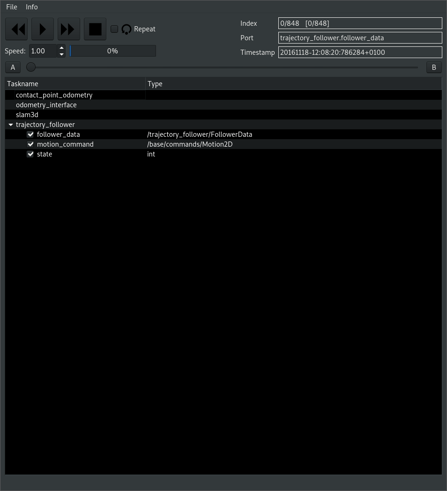

# Rock Replay    

A fast log file replay package for rock's logging system, written completely in C++. Currently, it utilizes Qt4, which is abandoned in Ubuntu 20.04 and later. Qt5 support is planned to be implemented next.



## Usage
Run the following from a terminal with sourced env.sh:
```
Usage: rock-replay2 {logfile|*}.log or folder.
Logging can be controlled via base-logging variables.
Available options:
  --help                show this message
  --prefix arg          add prefix to all tasks
  --whitelist arg       comma-separated list of regular expressions to filter 
                        streams
  --headless            only use the cli
  --rename arg          rename task, e.g. trajectory_follower:traj_follower
  --log-files arg       log files
```

## Bug Reports and Feature Requests
Please use the [GitHub Issue Tracker](https://github.com/rock-cpp/rock_replay/issues) of this repository.

## Contributing
See [here](doc/CONTRIBUTING.md) for information.

## Versioning
The software is versioned using [Semantic Versioning](https://semver.org/).

## Licence
See [LICENCE](LICENCE).

## Maintainer
Dennis Hemker 


